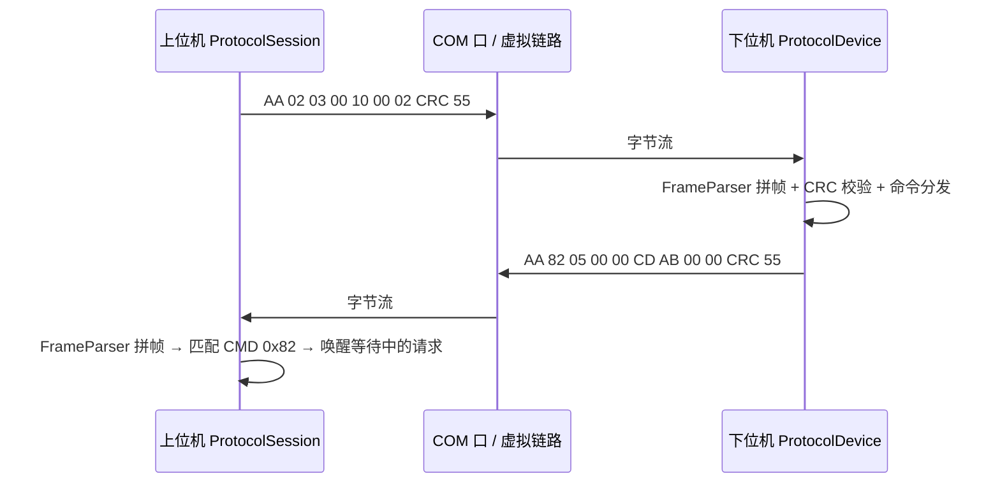

# RS-232 串口通讯协议 Demo（C#）

用 C# 实现一套 RS-232 通讯协议，并通过 **USB 转串口设备**（CH340 / CP2102 / FT232 / PL2303 等，在系统中表现为 COM 口）
与下位机收发数据。项目自带协议库、控制台 Demo、WinForms 调试助手，以及**无需硬件即可运行的自检**。

- 目标框架：**.NET Framework 4.8**（Win10/Win11 自带运行时）
- 依赖：**零 NuGet 依赖**，`System.IO.Ports` 位于 BCL 中，可完全离线编译运行
- 语言：C# 9（`LangVersion=9.0`，启用可空引用类型）

## 1. 目录结构

```
serialCommunication/
├── SerialPortDemo.sln
├── src/
│   ├── SerialPortDemo.Core/            协议 + 串口通道（可复用的核心库）
│   │   ├── Hex.cs                      十六进制解析/格式化/报文转储
│   │   ├── Protocol/
│   │   │   ├── Crc16.cs                CRC16/MODBUS 查表实现
│   │   │   ├── CommandCode.cs          命令码（含应答标志位约定）
│   │   │   ├── StatusCode.cs           应答状态码
│   │   │   ├── ProtocolFrame.cs        帧结构 + 编解码（TryDecode/Encode）
│   │   │   ├── FrameParser.cs          流式解析：粘包/半包/噪声/CRC 错误
│   │   │   ├── ParserStatistics.cs     接收质量统计
│   │   │   ├── ProtocolException.cs    协议异常 + 帧事件参数
│   │   │   └── ProtocolSession.cs      上位机会话：一问一答、超时、事件
│   │   ├── Transport/
│   │   │   ├── ITransport.cs           字节流通道抽象（真实串口/虚拟链路通用）
│   │   │   ├── SerialPortSettings.cs   串口参数 + 端口枚举
│   │   │   ├── SerialTransport.cs      SerialPort 封装（独立读线程 + 拔线处理）
│   │   │   ├── TransportEventArgs.cs   收发/错误事件参数
│   │   │   └── TransportClosedException.cs
│   │   ├── Device/
│   │   │   ├── ProtocolDevice.cs       下位机协议实现（命令分发 + 应答）
│   │   │   └── RegisterFile.cs         保持寄存器区
│   │   ├── Simulation/
│   │   │   └── VirtualSerialLink.cs    虚拟串口链路（无硬件联调）
│   │   └── Usb/
│   │       └── UsbSerialDeviceEnumerator.cs  用 WMI 识别 USB 转串口设备
│   ├── SerialPortDemo.Demo/            控制台 Demo（菜单 / 自检 / 回环测试）
│   └── SerialPortDemo.Gui/             WinForms 串口调试助手
└── README.md
```

## 2. 快速开始

```bash
# 1) 编译（离线即可完成）
dotnet build SerialPortDemo.sln

# 2) 协议自检：虚拟链路跑一遍协议栈，不需要任何硬件
dotnet run --project src/SerialPortDemo.Demo -- --selftest

# 3) 列出串口，确认 USB 转串口设备被识别
dotnet run --project src/SerialPortDemo.Demo -- --list

# 4) 交互式菜单（含虚拟链路，可无硬件体验完整收发流程）
dotnet run --project src/SerialPortDemo.Demo

# 5) WinForms 调试助手
dotnet run --project src/SerialPortDemo.Gui
```

自检输出示例（共 37 项，覆盖 CRC、编解码、粘包/半包、错误帧、端到端、超时）：

```
-- 1. CRC16/MODBUS 已知向量
  [通过] CRC16("123456789") == 0x4B37
  ...
-- 6. 端到端：PING / 写寄存器 / 读寄存器
  [通过] 写寄存器后设备侧数值同步
  [通过] 连续读 3 个寄存器内容正确
自检结果：通过 37 项，失败 0 项
```

### 命令行参数

| 命令 | 说明 |
| --- | --- |
| （无参数） | 交互式菜单 |
| `--list` | 列出串口及 USB 设备信息（友好名、PNP 实例 ID） |
| `--selftest` | 协议自检（虚拟链路，无需硬件） |
| `--loopback COM3` | 硬件回环测试（需短接 TX/RX），可加 `--rounds 5 --size 8` |
| `--monitor COM3` | 只接收并解析报文，Ctrl+C 退出 |
| `--port COM3 --ping` | 打开端口并 PING |
| `--port COM3 --read 0x0000 --count 8` | 读保持寄存器 |
| `--port COM3 --write 0x0010 --value 0xABCD` | 写单个寄存器（也可写 `--write 0x0010=0xABCD`） |
| `--port COM3 --send "AA 01 00 00 20 00 55"` | 发送原始字节 |

通用可选参数：`--baud 115200`（默认）、`--timeout 1000`（应答超时毫秒）。

## 3. 协议说明

### 3.1 帧格式（小端）

| 偏移 | 字段 | 长度 | 说明 |
| --- | --- | --- | --- |
| 0 | `SOF` | 1 | 帧头，固定 `0xAA` |
| 1 | `CMD` | 1 | 命令码，`bit7=1` 表示应答帧 |
| 2 | `LEN` | 2 | `DATA` 字节数（0 ~ 1024），小端 |
| 4 | `DATA` | LEN | 负载数据 |
| 4+LEN | `CRC16` | 2 | CRC16/MODBUS，覆盖 `CMD + LEN + DATA`，低字节在前 |
| 6+LEN | `EOF` | 1 | 帧尾，固定 `0x55` |

整帧长度 = `7 + LEN`，最大 1031 字节。

- **CRC 覆盖范围不含 `SOF`/`EOF`**：这样帧头和帧尾只用于定界，校验只保护有效数据。
- **`SOF`/`EOF` 不参与转义**：负载不做字节填充，靠 `LEN` + CRC 做定界与校验。
  若负载中经常出现 `0xAA`/`0x55`，建议按“长度优先”的顺序校验（本实现即如此：先按 LEN 取够字节，再校验 CRC 和帧尾）。
- CRC16/MODBUS 参数：多项式 `0x8005`（反射 `0xA001`）、初值 `0xFFFF`、输入/输出反射、结果不取反。

### 3.2 命令码

| 命令 | 值 | 请求 DATA | 应答 DATA |
| --- | --- | --- | --- |
| `PING` | `0x01` | 无 | `[状态(1)] [运行时间 ms(4, 小端)]` |
| `READ` | `0x02` | `[起始地址(2, 小端)] [个数(1)]` | `[状态(1)] [寄存器值(2×个数, 小端)]` |
| `WRITE` | `0x03` | `[地址(2, 小端)] [数值(2, 小端)]` | `[状态(1)]` |

应答帧命令码 = 请求命令码 `| 0x80`，例如 `PING` 的应答是 `0x81`（`PING-ACK`）。

### 3.3 状态码（应答 DATA 第 1 字节）

| 状态 | 值 | 含义 |
| --- | --- | --- |
| `Ok` | `0x00` | 成功 |
| `UnknownCommand` | `0x01` | 未知命令 |
| `BadParameter` | `0x02` | 参数错误 |
| `AddressOutOfRange` | `0x03` | 地址越界 |
| `CrcError` | `0x04` | 校验错误（预留） |
| `PayloadTooLarge` | `0x05` | 数据过长（预留） |

上位机侧由 `ProtocolFrame.EnsureSuccess()` 统一判断，非 0 时抛 `ProtocolException`（携带状态码）。

### 3.4 示例报文

| 报文 | 说明 |
| --- | --- |
| `AA 01 00 00 20 00 55` | `PING` 请求（CRC=0x0020） |
| `AA 81 05 00 00 11 00 00 00 D9 9B 55` | `PING` 应答：状态 0，运行时间 17 ms |
| `AA 02 03 00 0A 00 02 E4 3A 55` | 读寄存器：起始地址 `0x000A`，个数 2 |

### 3.5 一次完整交互



## 4. 与真实硬件联调

1. **插上 USB 转串口设备**（或带 USB 转串口芯片的开发板），安装对应驱动（CH340 / CP210x / FTDI / PL2303）。
2. `dotnet run --project src/SerialPortDemo.Demo -- --list` 确认端口已出现，例如
   `COM3  USB-SERIAL CH340 (COM3)  [USB]`。
3. **先做回环测试**：把该串口的 TX 与 RX 短接（DB9 的 2、3 脚，或用回环头），然后
   `dotnet run --project src/SerialPortDemo.Demo -- --loopback COM3`。
   该测试会发送若干随机帧并校验能否原样收回，用来单独验证「USB 转串口芯片 + 驱动 + 线缆 + 解析器」这条链路。
4. **再与下位机联调**：`--ping` 握手 → `--write` 下发参数 → `--read` 回读校验；
   或打开 GUI 观察字节流与协议帧两层信息。

### 常见问题排查

| 现象 | 排查方向 |
| --- | --- |
| 端口列表为空 | 驱动未装 / 数据线只供电不传数据 / 设备未上电 |
| 打开端口失败 | 端口号写错、被其它程序（调试助手、Modbus 工具）占用 |
| 收到数据但解析不出帧 | 波特率不一致、TX/RX 未交叉、共地缺失；打开 GUI 看原始 HEX 与 CRC 错误计数 |
| 偶发 CRC 错误 | 线缆过长 / 未共地 / 无屏蔽；可降波特率或加超时重试 |
| 拔掉 USB 后程序无反应 | 本项目已处理：`SerialTransport` 会触发 `Error` + `Closed` 事件，提示重新打开 |

> 说明：232 三线制（TX / RX / GND）务必**共地**；长距离或强干扰环境下建议用 485 或加隔离。

## 5. 分层设计要点

| 层 | 类型 | 职责 |
| --- | --- | --- |
| 通道层 | `ITransport` / `SerialTransport` / 虚拟端点 | 只负责收发**字节**，不理解协议 |
| 协议层 | `ProtocolFrame` / `FrameParser` | 字节流 ↔ 协议帧，负责定界、CRC、错误统计 |
| 会话层 | `ProtocolSession` | 一问一答、应答匹配、超时、事件上报 |
| 设备层 | `ProtocolDevice` / `RegisterFile` | 下位机侧：命令分发 + 应答 |
| 应用层 | Demo / GUI | 菜单、命令行、图形界面 |

几个刻意的设计选择：

- **不用 `SerialPort.DataReceived`**：该事件的触发时机与分片方式由驱动决定，容易让人误以为「一次事件 = 一帧」。
  这里用独立线程 + `BaseStream.Read` 收原始字节，再交给 `FrameParser`，粘包/半包问题在解析器里统一处理。
- **`FrameParser` 是状态机 + 滚动缓冲**：噪声字节会被丢弃并重新同步（`ResynchronizedBytes` 计数），
  CRC 错误只丢 1 字节后继续找下一个帧头，不会因为一次干扰丢掉后续的正常帧。
- **`ITransport` 让协议与硬件解耦**：同一套协议代码既能跑真实串口（`SerialTransport`），
  也能跑内存虚拟链路（`VirtualSerialLink`），因此自检、回归测试不需要硬件。
- **`ProtocolDevice` 与 `ProtocolSession` 对称**：一个当从站、一个当主站，方便把从站逻辑直接搬到设备侧（或先用虚拟链路联调上位机）。

## 6. 移植与扩展

**改用 .NET 8/9**（需要联网还原 `System.IO.Ports` 包）：

```xml
<TargetFramework>net8.0-windows</TargetFramework>
<ItemGroup>
  <PackageReference Include="System.IO.Ports" Version="8.0.0" />
</ItemGroup>
```

或用 SDK 命令：`dotnet add package System.IO.Ports`。除此之外的代码无需修改（协议层未使用 net48 特有 API）。

**协议可扩展点**：

- 需要区分「迟到应答」时，可在 `CMD` 后加 1 字节序号（`SEQ`），`ProtocolSession` 按序号匹配；
  当前实现是纯一问一答，**应答超时后若设备迟到应答，会被当作下一次请求的应答**，可用 `SEQ` 彻底解决。
- 负载中 `0xAA`/`0x55` 频繁出现时，可加入字节转义（如 `0x7E` 转义 + 反转义），代价是吞吐略降。
- 多机总线（485）场景可加 `ADDR` 地址字段，从站在地址不匹配时静默丢弃。
- 需要更高吞吐可把 `MaxPayloadLength` 调大，并同步调整 `FrameParser` 的缓冲长度（二者共用同一常量）。
